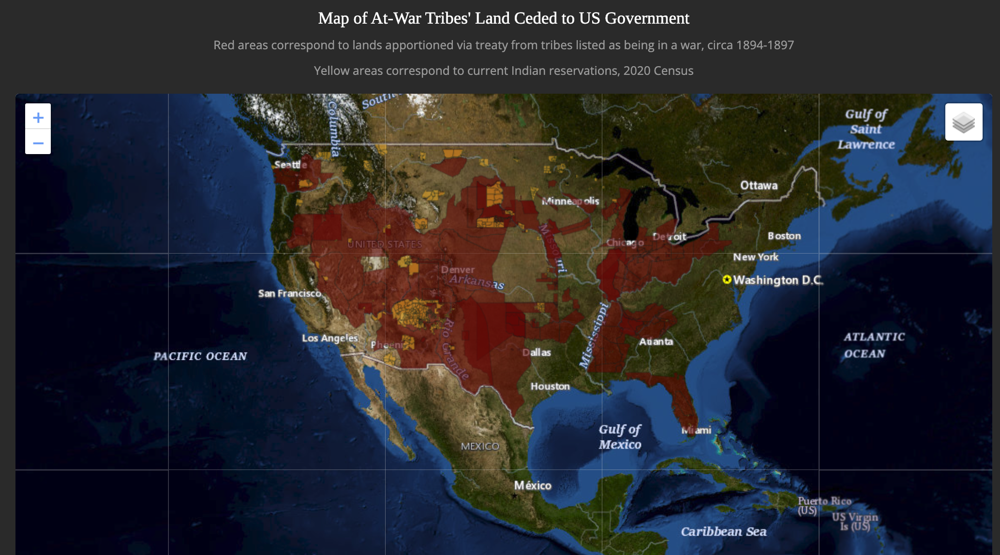

# United States Government Wars Against Indigenous Peoples
## A visualization
Inspired by blog post from [Evan Morrison](https://evanstruth.com/2021/10/13/for-indigenous-peoples-day-i-made-a-spreadsheet/). 
Compiled and Created by Ian Mac Moore, 2023

This is an attempt to provide a sense of scale to the continuous, persistent genocidal miltary actions taken by the US Government again indigenous peoples since its very inception. Indeed, these efforts were part of the habitation of white people since first recorded  landing in 1492. However the focus here is on the society which currently exists. It's not a complete picture, it's a jumping off point. The red areas show what was taken by force from tribes recorded as being at war, and then codified in treaties (usually after defeat). Missing from this data (wikipedia article listed below) are the "non-military" actions taken against the societies as a whole. War isn't necessarily genocide. Combined however with atrocity upon atrocity off the battlefield one must constitute the entirety as such.

## Tools Used
* [Leaflet JS](https://leafletjs.com/)
* [d3 JS](https://d3js.org/)
* [Plotly JS](https://plotly.com/javascript/)
* [Leaflet Providers](https://leaflet-extras.github.io/leaflet-providers/preview/)
* [USGS Imagery and Topo basemap](https://basemap.nationalmap.gov/)
* [Material Design Bootstrap CSS Template](https://mdbootstrap.com/freebies/dark-theme/)
* [Embed Markdown with md-block](https://md-block.verou.me/)
* [Color Palette generation](https://coolors.co/)
* Jupyter Notebook, Python, SQLite

### References and additional resources
* [Tribal Lands Ceded to the United States, data.gov, accessed
2023/03/07](https://catalog.data.gov/dataset/tribal-lands-ceded-to-the-united-states-feature-layer-cf3ca)
* [American Indian Areas Related National Geodatabase (zip file download), used to extract reservations geojson data](https://www2.census.gov/geo/tiger/TGRGDB20/tlgdb_2020_a_us_aiarelated.gdb.zip)
* [US Census Geodatabases download page, accessed 2023/03/13](https://www.census.gov/geographies/mapping-files/time-series/geo/tiger-geodatabase-file.html)
* [Original blog post inspiration, Evan Morrison, accessed
2023/03/07](https://evanstruth.com/2021/10/16/the-usa-a-nation-at-war/)
* [List of wars, Wikipedia, accessed
2023/03/07](https://en.wikipedia.org/wiki/List_of_wars_involving_the_United_States)
* [Quote from Excerpt, accessed
2023/03/09](https://www.penguinrandomhouse.ca/books/237686/an-indigenous-peoples-history-of-the-united-states-by-roxanne-dunbar-ortiz/9780807057834/excerpt)
